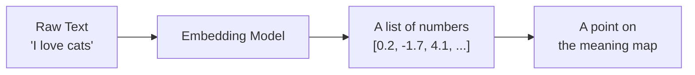
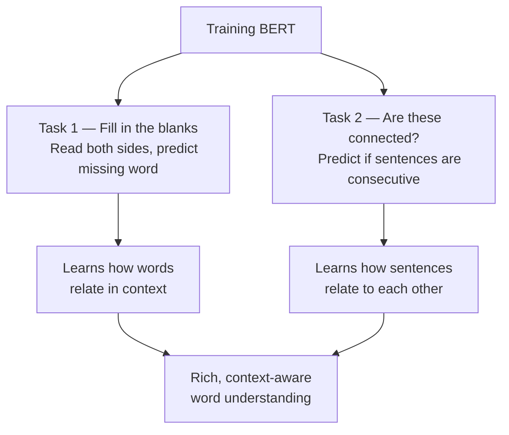
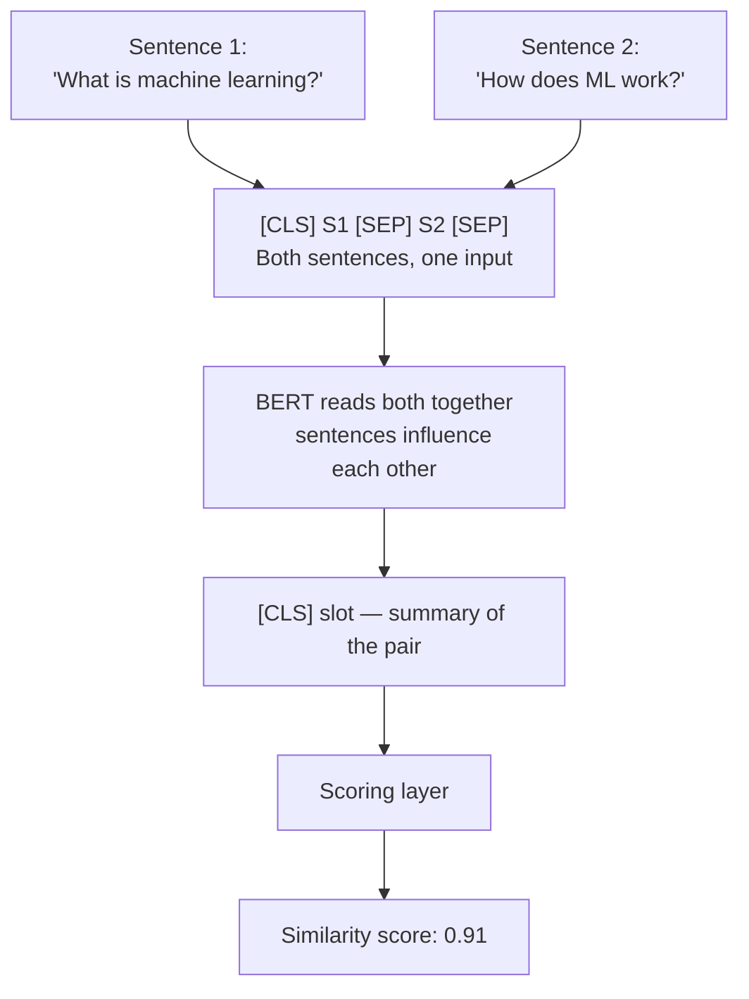
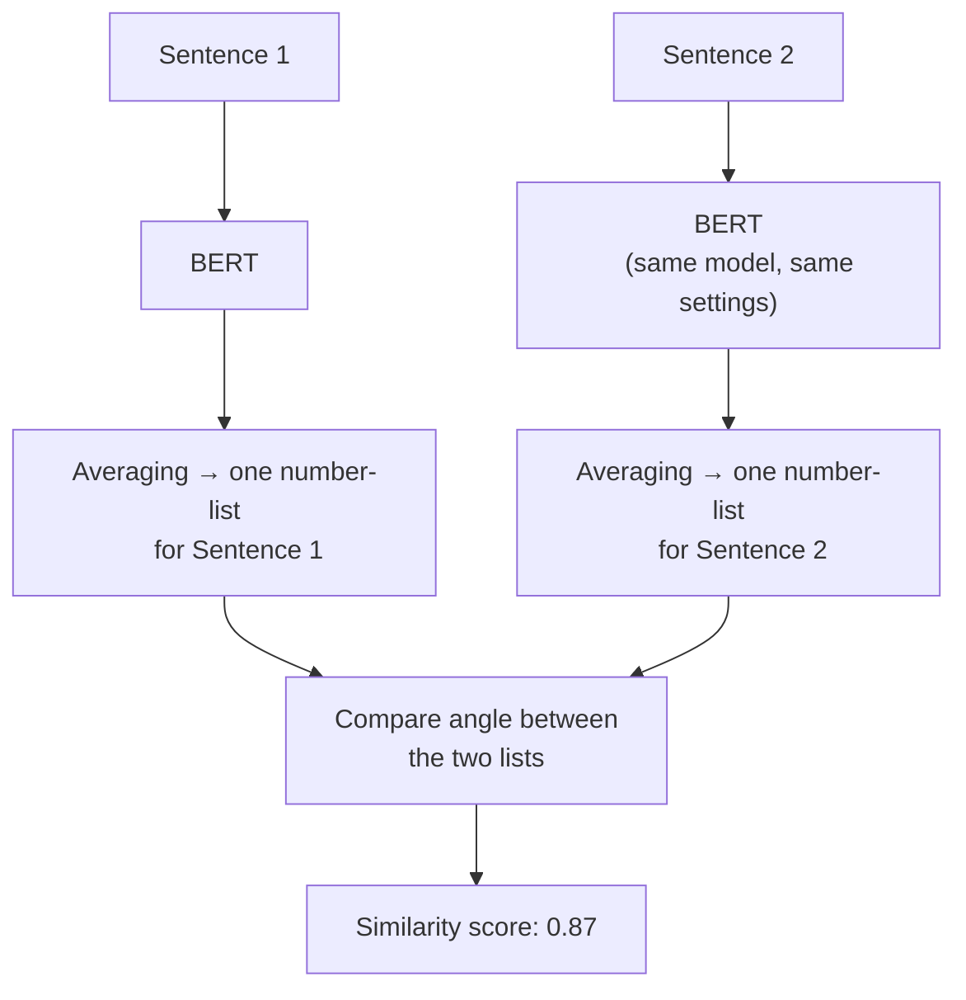

---
{"dg-metatags":{"description":"Why BERT falls short for sentence similarity — and how Bi-encoders and Cross-encoders solve it differently, explained from scratch with plain English analogies.","title":"Bi-encoders vs Cross-encoders — Sentence Similarity Explained Simply","og:title":"Bi-encoders vs Cross-encoders — Sentence Similarity Explained Simply","og:type":"article","og:article:author":"Hemant Bothra","og:article:tag":"AI, ML, NLP, Embeddings, BERT, SentenceTransformers, RAG","og:article:section":"Technology"},"dg-publish":true,"comments":true,"tags":["AI","ML","NLP","Embeddings","BERT","SentenceTransformers","RAG"],"source":"https://dailydoseofds.com","series":"Foundations of Text Representations — Part 1","permalink":"/ml-ai-tutorial/bi-encoders-vs-cross-encoders-sentence-similarity/","metatags":{"description":"Why BERT falls short for sentence similarity — and how Bi-encoders and Cross-encoders solve it differently, explained from scratch with plain English analogies.","title":"Bi-encoders vs Cross-encoders — Sentence Similarity Explained Simply","og:title":"Bi-encoders vs Cross-encoders — Sentence Similarity Explained Simply","og:type":"article","og:article:author":"Hemant Bothra","og:article:tag":"AI, ML, NLP, Embeddings, BERT, SentenceTransformers, RAG","og:article:section":"Technology"},"dgPassFrontmatter":true}
---


# Bi-encoders vs Cross-encoders — Sentence Similarity Explained Simply

> **The core question:** Given two sentences, how do we teach a machine to score *how similar* they are in meaning?

---

## Why does any of this matter?

Before we touch any technical concept, let's understand the real problem.

Imagine you have 10,000 customer support articles. A user types: *"my card isn't working abroad."* You need to find the most relevant article — fast.

The simple approach: scan for articles containing the exact words "card", "working", "abroad". But what if the best article says *"international transaction declined"*? It matches perfectly in meaning, but shares zero words with the query. Word-matching fails here.

This is called **sentence similarity scoring** — figuring out how similar two pieces of text are in *meaning*, not just in words used. It's the backbone of:

- **RAG systems** — find the right information before generating an answer
- **Search engines** — rank results by meaning, not just keywords
- **Duplicate detection** — same question, different wording (Quora, StackOverflow)
- **Question answering** — match a question to the most relevant answer

The challenge: how do you teach a machine to understand *meaning*?

---

## Step 1 — Turning words into numbers

Machines can't read text. They only work with numbers. So we need a way to convert words into numbers that *preserves meaning*.

Think of it like a city map. Every word gets a location on the map. The map is designed so words with similar meanings end up close to each other. "Happy" and "Joyful" are neighbours. "Happy" and "Volcano" are on opposite ends of the city.

These locations are called **embeddings** — just a list of numbers that represents where a word sits in meaning-space.

Once every word (and sentence) has a location, finding similar ones becomes easy — just find what's nearby on the map.



---

## Step 2 — The first attempt: Static Embeddings

Around 2013–2017, models like **Word2Vec**, **GloVe**, and **FastText** were trained on huge amounts of text and produced one fixed location per word — like a permanent address on the meaning map. Anyone could download this "address book" and use it in their own projects.

These worked surprisingly well. For example:

> King − Man + Woman ≈ Queen

The map understood relationships between words. That was impressive at the time.

**But there was one big problem.**

The word *"table"* got one fixed location. Always. No matter what sentence it appeared in:

- *"Convert this data into a **table** in Excel"* → data structure
- *"Put this bottle on the **table**"* → a piece of furniture

Same word → same location → wrong. Context was completely ignored.

It's like using your school ID photo for every official document for the rest of your life. Technically identifies you, but misses everything about who you are in different situations.

---

## Step 3 — BERT: the same word, different meaning

In 2018, Google introduced **BERT**. The big idea: instead of one fixed location per word, give each word a location *based on the sentence it appears in*.

The word *"bank"* in:
- *"I deposited money at the bank"* → sits near "finance", "money"
- *"We sat on the river bank"* → sits near "water", "nature"

Same word, different sentence, different location. Context is now baked in.

### How did BERT learn to do this?

It was trained on a huge pile of text — books, Wikipedia, websites — using two clever tasks. The beauty of both tasks: the text itself created the training signal. No humans needed to label anything.

**Task 1 — Fill in the blanks (called MLM — Masked Language Modeling):**

Random words in a sentence get hidden. BERT has to guess what they were, using all the other words around them — both before and after. This is why it's called *Bidirectional* — it reads in both directions at once.

> *"An [?] a day keeps the doctor away"* → BERT guesses *"apple"*

By doing this millions of times across billions of sentences, BERT learns how words relate to their neighbours.

**Task 2 — Are these connected? (called NSP — Next Sentence Prediction):**

BERT is shown two sentences and asked: did these actually appear one after the other in a real article, or were they randomly paired together?

> S1: *"An apple a day keeps the doctor away"*
> S2: *"It highlights the health benefits of eating apples regularly."*
> → Connected? Yes.

This teaches BERT to understand how sentences relate to each other.



After training on billions of sentences, BERT became very good at understanding the nuance of language.

---

## Step 4 — The gap: BERT still can't compare sentences reliably

Here's the twist — and this is the whole reason this article exists.

BERT gives you one number-list per **word**. Not per sentence. Feed it the sentence *"I love vector databases"* and you get back four separate number-lists — one for each word.

To compare two sentences, you need one number-list per sentence. The obvious shortcut: **average all the word lists** into a single one. This is called *mean pooling* — you're just taking the average across all words.

Sounds fine. But it breaks in practice.

**A simple analogy.** Imagine you want to describe a song using a single number. You decide to average the volume of every second of the song. A loud rock anthem and a quiet lullaby might end up with the same average volume. The number tells you almost nothing about what the song actually *is*.

Same problem here. Two completely different sentences can average out to a similar number-list by coincidence. Two sentences that mean the same thing can average to very different numbers.

The deeper reason: BERT was trained to fill in blanks and spot sentence connections. Neither of those tasks told it *"put sentences with similar meanings close together on the map."* So when you average its word-level outputs, the sentence-level positions are unreliable.

> BERT was trained to understand individual words deeply. It was never taught to compare whole sentences.

That's the gap. Two approaches were built to fill it.

---

## Step 5 — Two ways to solve it

### Cross-encoder — The judge who reads both files together

A cross-encoder takes **both sentences and feeds them into BERT as one combined input**, joined by a special marker `[SEP]`:

```
[CLS] Sentence 1 [SEP] Sentence 2 [SEP]
```

`[CLS]` is a special slot at the very start — BERT uses it as a summary of the entire input. `[SEP]` just marks where one sentence ends and another begins.

BERT reads the whole thing at once. So while it's processing Sentence 1, it can already "see" Sentence 2 — the two sentences influence each other's understanding throughout. At the end, the `[CLS]` slot holds a combined summary of both, which gets passed through a simple scoring layer to produce a number between 0 (not similar) and 1 (very similar).



The model is trained on labeled sentence pairs — similar pairs score close to 1, different pairs close to 0. Over time it learns to catch subtle similarities and differences.

✅ **Very accurate** — sentences directly interact during the whole reading process. Nothing is lost.

❌ **Doesn't scale.** You must feed both sentences together every single time. You can't pre-store or reuse anything. Comparing one query against 10,000 documents means 10,000 separate runs through BERT. For a real product, that's far too slow.

---

### Bi-encoder — The recruiter who scores each CV separately

A bi-encoder runs each sentence through BERT **on its own** — the same BERT model, same settings, but separately. Each sentence gets its own number-list, compressed into a single list via averaging. You then compare the two lists using a measure called **cosine similarity** — it looks at the angle between the two points on the meaning map. Small angle = similar meaning. Large angle = different meaning.



The key: this model is fine-tuned with a clear goal — *sentences with similar meanings must end up close on the map*. After training, you can run every document in your library through BERT once, store all the number-lists, and at query time just run the query through once and find what's nearby.

✅ **Fast and scalable.** Pre-process documents once. Compare millions in milliseconds at query time.
✅ **Powers RAG and search.** This is how modern AI search actually works.

❌ **Slightly less accurate.** Sentences never see each other during encoding — some fine detail is lost.
❌ **Needs more training data** to compensate.

The most widely used version of this: **SentenceTransformers (SBERT)**.

---

## Side-by-side comparison

| | Cross-encoder | Bi-encoder |
|---|---|---|
| How sentences are processed | Together in one go | Separately |
| Accuracy | Higher | Slightly lower |
| Speed with many documents | Slow | Fast |
| Can pre-store document results | No | Yes |
| Training data needed | Less | More |
| Best used for | Re-ranking a small shortlist | Finding candidates fast from a large set |

---

## How they work together in the real world

In production, both are combined:


Bi-encoder does the fast first pass. Cross-encoder adds precision over a small, already-filtered set. This is how modern search engines and RAG pipelines work under the hood.

---

## What's next — AugSBERT (Part 2)

Can we close the accuracy gap of bi-encoders?

**AugSBERT** does this by using the cross-encoder's accuracy to teach the bi-encoder:
1. Use a cross-encoder to generate high-quality similarity scores for a large set of unlabelled sentence pairs
2. Use those scores to train a bi-encoder

The bi-encoder ends up learning from the cross-encoder's judgement — getting much of the accuracy, while keeping the speed advantage. Part 2 covers the full implementation.

---

## ⚡ Quick Brush-Up — Come Back Here First

**The story in 6 lines:**

1. Machines need numbers to understand text → we convert words to map locations (**embeddings**)
2. Old models gave every word one fixed location, ignoring context (**static embeddings — broken**)
3. BERT gives each word a location based on the sentence it's in — same word, different context, different location (**contextual embeddings**)
4. But BERT was never trained to compare sentences — averaging its word locations is unreliable (**the gap**)
5. **Cross-encoder:** feed both sentences together → accurate but slow, can't pre-store anything (**judge reads both files side by side**)
6. **Bi-encoder:** encode each sentence separately → fast, storable, powers real search (**recruiter scores each CV on its own**)

---

**The mnemonic — "JR"**

> **J**udge (Cross-encoder) — reads everything together, deeply accurate, slow
> **R**ecruiter (Bi-encoder) — scores independently, fast at scale, small accuracy trade-off

**In production: Recruiter shortlists → Judge decides.**
That's your RAG pipeline in one sentence.

---

**Plain English glossary:**

| Word | What it means |
|---|---|
| Embedding | A word's location on a meaning map — stored as a list of numbers |
| Static embedding | One fixed location per word, ignores context |
| Contextual embedding | Location shifts based on the sentence the word is in |
| BERT | A model trained to deeply understand language in context |
| Corpus / Corpora | A large collection of text (one library / many libraries) |
| Mean pooling | Averaging all word locations into one number-list for the whole sentence |
| Cross-encoder | Scores two sentences by reading them together |
| Bi-encoder | Scores two sentences by reading each one separately |
| Cosine similarity | Measures how similar two map locations are by the angle between them |
| AugSBERT | Uses a cross-encoder to teach a bi-encoder — best of both |

---

**Two things the article doesn't tell you:**
- NSP (Task 2 in BERT's training) is now considered a weak technique. Later models like RoBERTa dropped it entirely and performed better. Most of BERT's power comes from Task 1 — fill in the blanks.
- Mean-pooled BERT isn't always terrible — for some tasks it's actually competitive. The SBERT improvement is most visible at scale and in proper semantic search benchmarks.

---

*Source: Daily Dose of Data Science — Avi Chawla (Oct 2024)*
